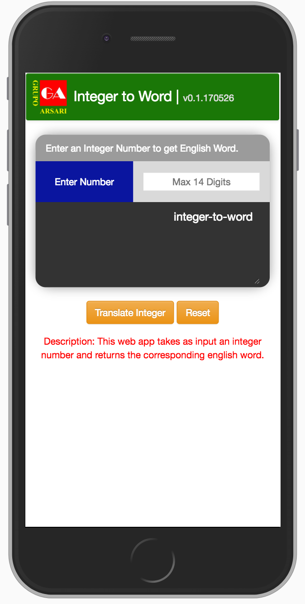

# Integer to Word

This web app takes as an input an integer parameter and returns the associated english word through a function called int-to-word().  Javascript is used as main programming language and HTML and CSS for UI.

##Examples
int_to_word(4527) == "four thousand five hundred twenty seven"
int_to_word(200017) == "two hundred thousand seventeen"
int_to_word(1000215) == "one million two hundred fifteen"

 Figure 1: ScreenShot Integer-to-Word iPhone Display
